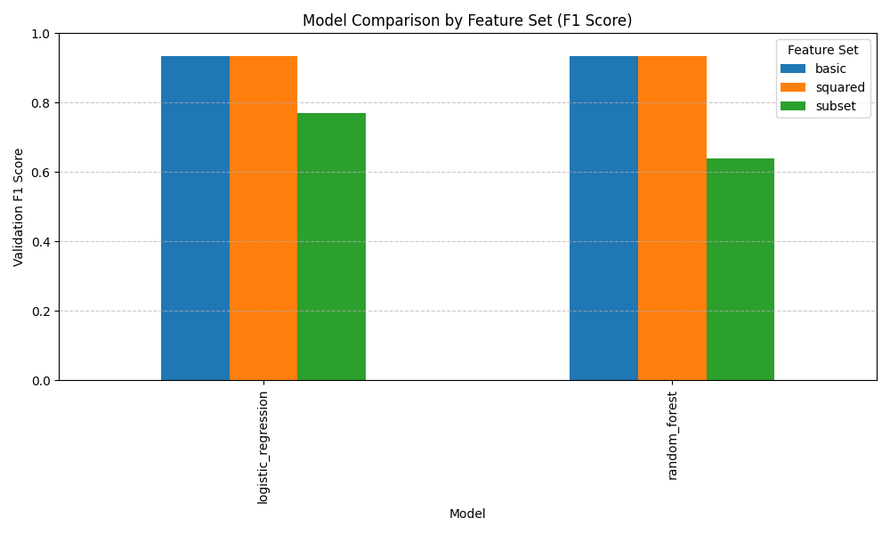
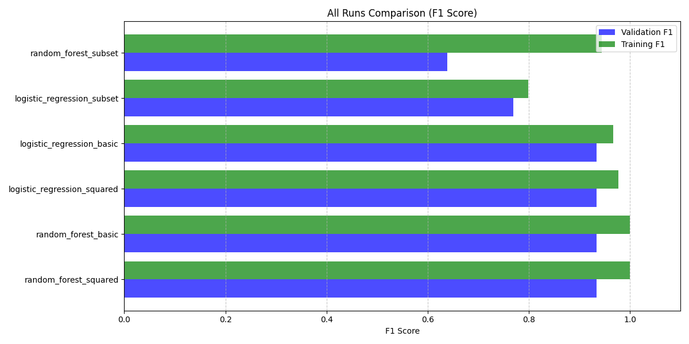

# MLflow Experiment Report

## Best Model
- Model: random_forest
- Feature Set: squared
- Validation F1: 0.9343
- Validation Accuracy: 0.9333

## Visualizations
- Model comparison chart: 
- All runs comparison: 

## Model Performance Summary
| model_name          | feature_set   | optimized   |   val_accuracy |   val_f1 |   train_accuracy |   train_f1 |
|:--------------------|:--------------|:------------|---------------:|---------:|-----------------:|-----------:|
| logistic_regression | basic         | False       |         0.9333 |   0.9343 |           0.9667 |     0.9666 |
| logistic_regression | squared       | False       |         0.9333 |   0.9343 |           0.9778 |     0.9778 |
| logistic_regression | subset        | False       |         0.7667 |   0.7700 |           0.8000 |     0.7994 |
| random_forest       | basic         | False       |         0.9333 |   0.9343 |           1.0000 |     1.0000 |
| random_forest       | squared       | False       |         0.9333 |   0.9343 |           1.0000 |     1.0000 |
| random_forest       | subset        | False       |         0.6333 |   0.6391 |           0.9444 |     0.9444 |